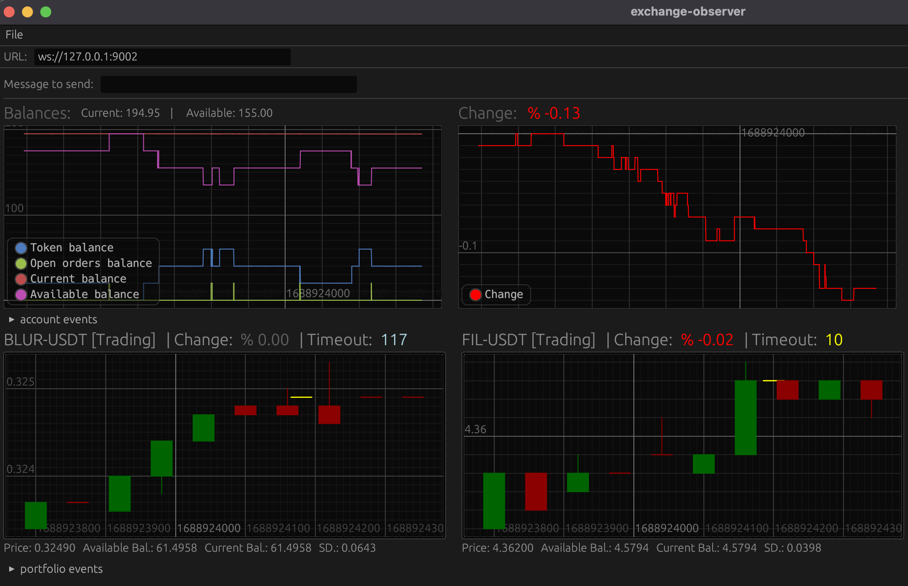

## Exchange Observer | Trading sim

A trading simulator for OKX exchange. Reads OKX websocket data and tries to make smart trades based on your [Strategy configuration](config-sample.toml) settings.

## Disclaimer

The trading simulation logic implemented is super rough and kinda dumb (im still _experimenting_ with it tho).
The `scheduler` will try to follow the line going up, by querying all tokens and buying whatever one is doing good numbers.
I'm just sharing this because i think its a good template to start with a stream based: `producer` -> `consumer` -> `app` architecture. (not event driven, at least for now)

That being said, im **not responsible** if you lose money by using it to trade with money.

Each setting in [config.toml](config-sample.toml) is explained but feel free open an issue to ask questions if something is not clear.

# Setup

## Required infrastructure

- Redpanda
- Scylla
- Pushover (optional)

## Components

- Producer (Okx websocket messages -> Redpanda)
- Consumer (Redpanda messages -> Scylla)
- Scheduler (ScyllaDB Queries -> Token evaluation -> UI)

## Deploy Redpanda and Scylla

```bash
docker-compose up -d
```

## Create required keyspace and tables in Scylla

Wait until the node is up and run the migrations.

```bash
alias nodetool="docker exec -it scylla nodetool"
nodetool status
### Should show 'UN' (up-normal)
Status=Up/Down
|/ State=Normal/Leaving/Joining/Moving
--  Address     Load       Tokens       Owns    Host ID                               Rack
UN  172.26.0.2  540 KB     256          ?       c35c31db-0c92-4064-b2ba-2da43fa6e1a0  Rack1
```

Run the migrations

```bash
alias cqlsh="docker exec -it scylla cqlsh"
cqlsh -f /tmp/migration.cql
```

## Endpoints

```bash
ScyllaDB: 127.0.0.1:9042
Redpanda: 127.0.0.1:9092
Redpanda console: http://localhost:8080/topics
```

## Configure data retention for each topic

The producer will create the topics based on the config.toml settings
To create them manually use:

```bash
alias rpk="docker exec redpanda rpk"
rpk topic create candle1m tickers trades --partitions 10 --replicas 1 -c cleanup.policy=compact

# Topic configuration is not available on the rskafka crate.
# To set 12hs retention use:
rpk topic alter-config candle1m tickers trades --set retention.ms=43200000 --brokers localhost
```

## Spin up all the producer and consumer

```bash
cargo run --bin producer
cargo run --bin consumer
```

## Configure scheduler account and strategy settings

```bash
vim config.toml
```

Start

```bash
cargo run --bin scheduler
```

## Scheduler terminal UI

This is how the scheduler UI looks with `ui.enable` = `true`


## Scheduler GUI

If using the scheduler with websocket server enabled you can connect to it using a very rough expermiental UI made with [egui](https://github.com/emilk/egui).
The console is just a listener, so cant send stuff back to the scheduler for now.

Run with:

```bash
cargo run --bin console
```



### Push Notifications

The scheduler can send status updates every 30 minutes informing you about your current balance, bot uptime and account change % if.
It will also send a notification when cash-outs and stop loss trigger.

## Debug

Connect to Scylla using `cqlsh`

```bash
docker exec -it scylla cqlsh
Use HELP for help.
cqlsh> use okx;
cqlsh:okx> describe tables;
candle1m  tickers  trades
cqlsh:okx> SELECT * FROM trades WHERE instid='XCH-USDT' ORDER BY ts DESC LIMIT 10;

 instid   | ts                              | tradeid  | px    | side | sz
----------+---------------------------------+----------+-------+------+----------
 XCH-USDT | 2022-10-01 21:34:00.425000+0000 | 19102621 |  33.4 |  buy | 0.040482
 XCH-USDT | 2022-10-01 21:33:59.339000+0000 | 19102620 | 33.41 |  buy | 0.132378
 XCH-USDT | 2022-10-01 21:33:49.342000+0000 | 19102619 | 33.41 |  buy | 0.103742
 XCH-USDT | 2022-10-01 21:33:48.423000+0000 | 19102618 | 33.41 |  buy | 0.088245
 XCH-USDT | 2022-10-01 21:33:40.424000+0000 | 19102617 |  33.4 |  buy | 0.103606
 XCH-USDT | 2022-10-01 21:33:36.340000+0000 | 19102616 | 33.42 |  buy | 0.086683
 XCH-USDT | 2022-10-01 21:33:31.423000+0000 | 19102615 | 33.41 |  buy | 0.066893
 XCH-USDT | 2022-10-01 21:33:26.423000+0000 | 19102614 | 33.41 | sell | 0.102778
 XCH-USDT | 2022-10-01 21:33:23.340000+0000 | 19102613 | 33.41 |  buy | 0.043765
 XCH-USDT | 2022-10-01 21:33:15.339000+0000 | 19102612 | 33.42 |  buy | 0.071039
(10 rows)
```

Delete topics from redpanda

```bash
rpk topic delete candle1m trades tickers
```

## Destroy

```bash
docker-compose down
```

### Tip:

If you only want to trade coins going up by a lot, set the `min_deviation` setting to something higher.

### More disclaimers:

The [producer](./producer) websocket gets disconnected constantly.
It will reconnect after connection gets closed, but thats just cheating lol, and we miss around 5 seconds of data which affects trading decisions.
